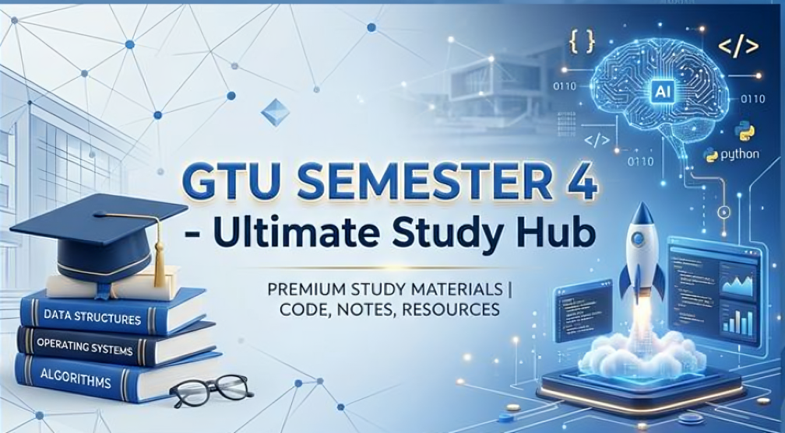

# GTU Semester 4 - Complete Study Material Repository

> A comprehensive study resource created by Dhruv Patel, designed to help GTU students in AI, Computer Science, and related branches excel in academics and score better CGPA for placements.

  

---

## 📋 About This Repository

<div align="center">
  
</div>

This repository is created with a single mission: **to help struggling students succeed academically and secure better placements through comprehensive, quality study materials.**

### 🎯 Purpose

This repository is created to:

- 📚 Provide high-quality, curated study materials for GTU Semester 4 courses
- 🚀 Help students who struggle with studies to score better marks
- 💼 Support students in maintaining good CGPA for placement opportunities
- 📈 Make quality education accessible to all students

### 💡 How You Can Support This Project

If you've found these materials helpful:

⭐ **Give this repository a STAR** - It helps more students discover these resources and increases visibility in the GTU community!

🤝 **Share with friends and your college** - Help spread this resource to your college groups and friends.

📢 **Spread the word** - Share this repo in your WhatsApp groups, college networks, and with other students who might benefit.

---

## 📚 Subjects Covered (Semester 4)

### 1. **Artificial Intelligence (AI)** `BE04043011`

**[📖 AI Detailed Guide](AI/README.md)**

- **Marks:** 70 | **Credits:** 3
- **Coverage:** 18 GTU papers + 12 unit notes + 2 Mid Papers
- **Key Topics:** Search algorithms, Knowledge Representation, Uncertainty Reasoning, NLP, Prolog
- **Best For:** AI, CSE & Related branch students
- **💡 Note:** Focus on Units 2, 3, 4, and 12 for high scoring!

---

### 2. **Discrete Mathematics & Graph Theory (DMGT)** `BE04000261`

**[📖 DMGT Detailed Guide](DMGT/README.md)**

- **Marks:** 70 | **Credits:** 3
- **Coverage:** 8 GTU papers + 13 unit files + 4 Mid Papers + 7 Practice Sets
- **Key Topics:** Logic, Set theory, Functions, Relations, **Graph theory & Algorithms**
- **Difficulty Level:** ⭐⭐⭐⭐⭐ (Essential for algorithms & logic)
- **⚠️ Pro Tip:** Unit 5 (Graphs) is 27% weightage - don't skip it!

---

### 3. **Data Science for Humanity (DSH)** `BE04000281`

**[📖 DSH Detailed Guide](DSH/README.md)**

- **Marks:** 70 | **Credits:** 4
- **Coverage:** 6 GTU papers + 8 unit notes + 4 Mid Papers
- **Key Topics:** Analytics, Probability, Sampling, **Regression**, **Classification (Trees)**, Case Studies
- **Most Important:** Units 3, 4, and 7 cover core statistical & ML concepts
- **💡 Tip:** Statistical distributions and regression are high-scoring calculation areas!

---

### 4. **Environmental Science (ES)** `BE04000101`

**[📖 ES Detailed Guide](ES/README.md)**

- **Marks:** 70 | **Credits:** 2
- **Coverage:** 11 GTU papers + 14 resource files + 4 Mid Papers + 2 reference books
- **Key Topics:** Pollution, Sustainability, Circular Economy, Renewable Energy, Green Hydrogen
- **Best for:** Core course for all engineering branches
- **⭐ Focus:** Units 3 and 4 account for 60% of the weightage!

---

### 5. **Object-Oriented Programming (OOPs)** `BE04000231`

**[📖 OOPs Detailed Guide](OOPs/README.md)**

- **Marks:** 70 | **Credits:** 4
- **Coverage:** 12 GTU papers + 8 unit notes + **60+ Practical Java Programs**
- **Key Topics:** Classes, Inheritance, Polymorphism, Exception handling, GUI, File I/O, Multithreading, JDBC
- **Unique Feature:** 60+ fully working Java practical examples included!
- **💻 Practice:** Master units 3, 4, and 5 as they carry 60% weightage!

---

### 6. **Operating Systems (OS)** `BE04000221`

**[📖 OS Detailed Guide](OS/README.md)**

- **Marks:** 70 | **Credits:** 4
- **Coverage:** 10 GTU papers + 11 unit notes + 1 Mid Paper
- **Key Topics:** Processes, **CPU Scheduling**, Synchronization, **Deadlock**, Memory management, Virtualization
- **Most Critical:** Units 2, 4, and 6 carry the highest marks and calculation-based problems
- **📊 Tip:** Always draw Gantt charts for scheduling problems to score full marks!

---

## 📊 Repository Statistics

| Metric                           | Count                              |
| :------------------------------- | :--------------------------------- |
| **Total Subjects**               | 6                                  |
| **Total GTU Question Papers**    | 65 Papers                          |
| **Total Unit Notes & Resources** | 66 Files                           |
| **Practical Code Examples**      | 60+ Java programs                  |
| **Mid-Exam Papers**              | 19 Papers                          |
| **Reference Materials**          | 2 Reference Books + Question Banks |
| **Quality Rating**               | **High Premium Content**           |

---

## ✨ Repository Highlights

### 📚 Best Resources Per Subject

| Subject  | Star Features                                                      |
| :------- | :----------------------------------------------------------------- |
| **AI**   | 18 GTU papers (2012-2023), Prolog implementations                  |
| **DMGT** | 7 Practice sets, Hasse diagrams, Logic tutorials                   |
| **DSH**  | Classification trees, Probability distributions, Regression models |
| **ES**   | 2 Atul reference books pdf, Sustainability & Green Hydrogen notes  |
| **OOPs** | 60+ working Java programs, Exception handling & Collections        |
| **OS**   | Scheduling algorithms, Memory management, Shell scripting          |

### 🎯 Most Important Topics Across All Subjects

| Subject  | Top 3 High-Frequency Topics                                 |
| :------- | :---------------------------------------------------------- |
| **AI**   | Heuristic Search, Knowledge Representation, Prolog          |
| **DMGT** | Graphs & Trees, Propositional Logic, Relations              |
| **DSH**  | Classification, Probability, Regression                     |
| **ES**   | Sustainability, Renewable Energy, Pollution Control         |
| **OOPs** | Inheritance & polymorphism, Exception handling, Collections |
| **OS**   | Scheduling, Memory Management, Deadlock                     |

---

## 📚 Study Material Organization

```
GTU_SEM_4/
├── AI/
│   ├── README.md (Study guide + exam strategy)
│   ├── GTU Paper/ (18 papers)
│   ├── mid/ (2 mid papers)
│   └── Notes/ (12 units)
│
├── DMGT/
│   ├── README.md (Study guide + tips)
│   ├── GTU Paper/ (8 papers)
│   ├── mid/ (4 mid papers)
│   ├── notes/ (11 notes + 7 practice)
│   └── practice set/
│
├── DSH/
│   ├── README.md (Study guide)
│   ├── GTU Paper/ (6 papers)
│   ├── mid/ (4 mid papers)
│   └── notes/ (8 units)
│
├── ES/
│   ├── README.md (Study guide)
│   ├── GTU Paper/ (11 papers)
│   ├── mid_papers/ (4 papers)
│   ├── notes/ (Detailed guides)
│   └── Book/ (2 reference books)
│
├── OOPs/
│   ├── README.md (Study guide)
│   ├── GTU Paper/ (12 papers)
│   ├── mid/ (4 mid papers)
│   ├── notes/ (8 units)
│   └── codes/ (60+ Java programs)
│
├── OS/
│   ├── README.md (Study guide)
│   ├── GTU Paper/ (12 papers)
│   ├── mid/ (1 mid paper)
│   └── Notes/ (10 units)
│
└── README.md (This file)
```

---

## 💪 Subject Difficulty Ranking

**Based on syllabus weightage and concept complexity:**

| Ranking     | Subject                           | Difficulty | Time Required |
| ----------- | --------------------------------- | ---------- | ------------- |
| **EASIEST** | **ES (Environmental Science)**    | ⭐⭐       | 4-5 weeks     |
| **EASY**    | **AI (Artificial Intelligence)**  | ⭐⭐⭐     | 5-6 weeks     |
| **MEDIUM**  | **OOPs (Java Programming)**       | ⭐⭐⭐     | 6-7 weeks     |
| **MEDIUM**  | **OS (Operating Systems)**        | ⭐⭐⭐⭐   | 5-7 weeks     |
| **MEDIUM**  | **DSH (Data Structures)**         | ⭐⭐⭐⭐   | 5-6 weeks     |
| **HARDEST** | **DMGT (Discrete Math & Graphs)** | ⭐⭐⭐⭐⭐ | 6-8 weeks     |

---

## 🤝 Feedback & Suggestions

This repository is maintained by Dhruv Patel. If you have suggestions, find errors, or want to share your experience:

### Share Your Feedback:

- **Found an error?** - Report via GitHub Issues with details
- **Have suggestions?** - Open an issue with constructive feedback
- **Success story?** - Share how these materials helped improve your grades
- **Study tips?** - Suggestions for improvement are welcome

---

## 🌟 Share This Repository

### 📢 If This Repository Helped You

- ⭐ Hit the **STAR** button at the top right to increase visibility
- 🤝 **Share with friends** - Help them discover these resources
- 💬 **Share in college groups** - Post link in WhatsApp/Discord/Telegram groups
- 📣 **Recommend to others** - Word-of-mouth helps more students find this

---

## 📞 Support & Contact

- **GitHub Issues:** Report bugs or suggest improvements
- **GitHub Discussions:** Ask questions or discuss topics (if enabled)
- **Questions?** - Open an issue and I'll respond

---

## 🎊 Repository Info

| Aspect           | Details                      |
| ---------------- | ---------------------------- |
| **Created by**   | Dhruv Patel                  |
| **Maintenance**  | Solo-maintained              |
| **Last Updated** | March 2026                   |
| **Purpose**      | GTU Semester 4 Study Guide   |
| **Impact**       | Helping GTU students succeed |

---

## 📄 License & Usage Rights

**This repository is created for educational purposes.**

- ✅ Free to use for studying and learning
- ✅ Share with friends and colleagues
- ✅ Modify for your learning needs
- ✅ Distribute to help other students

**Please:**

- Respect original creators and sources
- Maintain academic integrity
- Don't use for commercial purposes
- Credit this repository if extending further

---

## 🙏 Credits & Resources

This repository is built using:

- 📖 Official GTU question papers and syllabus
- 👨‍🏫 Academic textbooks and reference materials
- 🎓 Standard teaching methodologies
- 💪 A vision to help struggling students succeed

---

## 🎯 Call to Action

### If you've found this repository helpful:

1. ⭐ **Give a STAR** - Increase visibility
2. 🤝 **Share with friends** - Spread the knowledge
3. 🎓 **Use effectively** - Study hard and score well!
4. 📢 **Recommend** - Tell others about this resource

### 💬 Your Success Story Matters!

Once you score well, come back and share your experience! Your success motivates others and helps us understand what works.

---

## 📊 Final Message

> **"Education is not about scoring marks. It's about understanding concepts and applying knowledge. These materials are designed to help you not just pass, but truly understand, so you become a better professional and contribute to society."**

Whether you're a topper, average student, or struggling with studies:

- 🎯 You CAN succeed with the right resources and effort
- 📚 These materials have been created to support YOUR journey
- 💪 Consistency and dedication matter more than perfection
- 🤝 You're not alone - Dhruv Patel created these materials to help you succeed

**Start your journey today. Study smart. Score well. Transform your future.**

---

## 📌 Quick Links

| Subject  | Guide                        | Papers                        | Notes                   |
| -------- | ---------------------------- | ----------------------------- | ----------------------- |
| **AI**   | [Read Guide](AI/README.md)   | [18 Papers](AI/GTU%20Paper)   | [12 Units](AI/Notes)    |
| **DMGT** | [Read Guide](DMGT/README.md) | [8 Papers](DMGT/GTU%20Paper)  | [11 Notes](DMGT/notes)  |
| **DSH**  | [Read Guide](DSH/README.md)  | [6 Papers](DSH/GTU%20Paper)   | [8 Units](DSH/notes)    |
| **ES**   | [Read Guide](ES/README.md)   | [11 Papers](ES/GTU%20Paper)   | [10 Guides](ES/notes)   |
| **OOPs** | [Read Guide](OOPs/README.md) | [12 Papers](OOPs/GTU%20Paper) | [60+ Codes](OOPs/codes) |
| **OS**   | [Read Guide](OS/README.md)   | [12 Papers](OS/GTU%20Paper)   | [10 Units](OS/Notes)    |

### 🎯 Quick Stats

| 📊 Subjects | 📝 Papers | 📖 Notes | 💻 Code | 📏 Pages  |
| :---------: | :-------: | :------: | :-----: | :-------: |
|    **6**    |  **67+**  | **57+**  | **60+** | **1200+** |

---

## 🌟 Made with ❤️ for GTU Students 🌟

#### If you found this helpful:

⭐ **Give a STAR** | 🤝 **Share with Friends** | 📚 **Study Smart, Score Better**

---

> Created by **[Dhruv Patel](https://dhruvpatelofficial.vercel.app/)**
> **Keep Learning. Keep Growing. Transform Your Future.** 🚀
